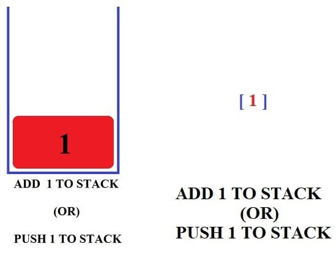
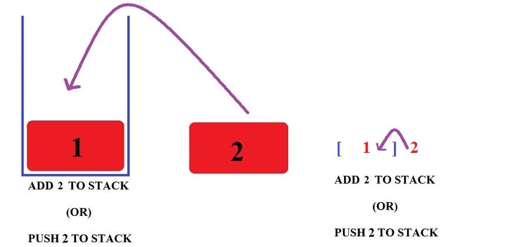
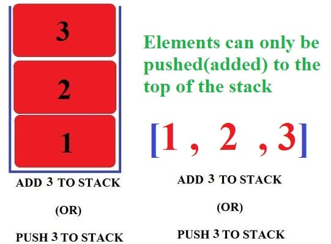
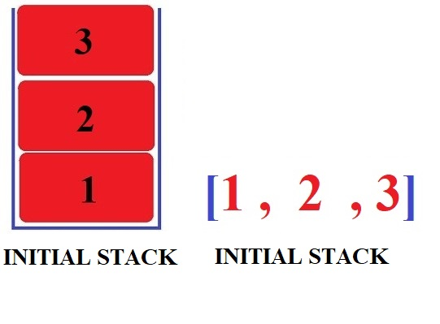
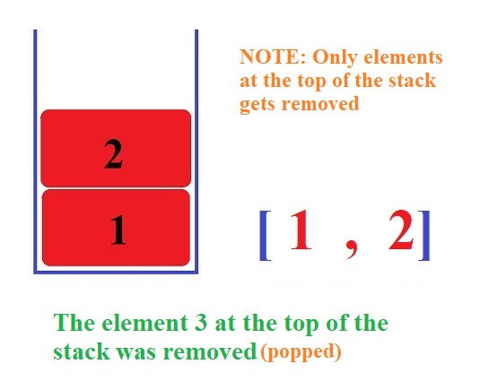
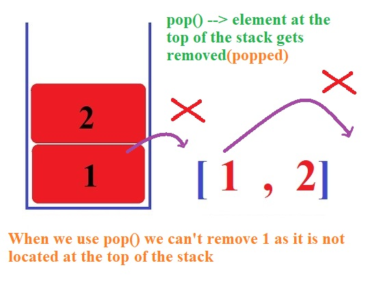
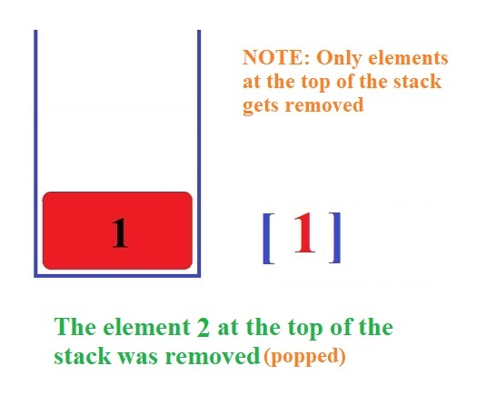

https://github.com/t-sibiraj/stack            [Light Mode](https://t-sibiraj.github.io/stack/)             [Dark Mode](https://htmlpreview.github.io/?https://github.com/t-sibiraj/stack/blob/main/index-dark.html)            [Download](https://github.com/t-sibiraj/stack/raw/main/stack.pdf)             [More](https://t-sibiraj.github.io/learn/)

# TABLE OF CONTENTS:

[TOC]

```

```

### 							**New topics will be added from time to time.**

```

```


```
Visit this link ( https://github.com/t-sibiraj/stack ) to get the latest version of this pdf.
```

# **DATA   STRUCTURES**

```python
Data structure is nothing but a particular way used to store and organize data
By storing the data in a data structure we can access it , modify it easily and effectively.
=============================================================================================

For example list in python is a data structure

student''s name ---> Data

We can store the above data in the form of list as follows
["ram","som","sibi"]

By storing the data(student''s name) in the form of list(data structure) we can

(i) easily access the student''s name via index
(ii) Update the data using del , pop() , insert() , remove() and etc..
```


# **DATA   TYPE   VS   DATA STRUCTURE(COMING SOON)**

```
Before we continue to learn about DS(Data Structures) it is important to know the difference between data type and data structure

Data type      -> int , float , str , List
Data Structure -> List , Stacks , Queues
```


# **STACKS**  

```python
Stack is basically a data structure like list
list --> [1,2,3]
stack --> [1,2,3]

Both use square brackets but their properties differ.

It follows a technique known as LIFO(Last In First Out)

STACK  -  LIFO:

I am gonna give you a basic idea of what LIFO technique and what stack is

Let''s say you are asked to stack up 5 boxes. What would you do ,first you will place the first box and you will stack the second box on top of the first box and the third box on top of the fourth box and finally you will stack the fifth box on top of the fourth box.

Even when you are asked to stack up 10 boxes you will do same process as above till you are done stacking up each boxes one by one.

Let''s say you are asked the remove a box from the stack of boxes, what will you do , do you remove the first box or the fifth box. Removing the fifth box would be the best choice as it placed on top of all the boxes , so removing it would be easy. While removing the first box we must be careful as the remaining four boxes are stacked on top of it. Even a light shacke while removing the first box would lead to the stack to collapse. So removing the first box is a wise choice.

The same above basic idea is used in stacks as the name suggests.
The technique above is called as LIFO and the data strucutre stack uses this technique.

The box which was **last inserted** was the **first** one to get **deleted(out)**
The element which was **last inserted** was the **first** one to get **deleted(out)**

inserted -----> push
deleted  -----> pop

```


​																         source: t-sibiraj.github.io/stack


## **PUSH   METHOD**

```python
In list we have various methods like pop() , insert() , remove() , sort() and etc..

Same like list we have various methods in stacks also.

push --> It is nothing but like insert in list . But here in stack we can only add element to the top of the stack. We can''t add element in between in stack.We can add elements linearly i.e on top of each other one by one.

NOTE: WE CAN''T ADD ELEMENTS IN BETWEEN

The idea of push is exaplined as follows
```

​                    

​																source: t-sibiraj.github.io/stack    

```python
  ------------------------------------------------
| Now we are adding(pushing) element 1 to the stack |
  -------------------------------------------------
```

​                        

​																source: t-sibiraj.github.io/stack                                      

=======================================================================================

​                                             

​																source: t-sibiraj.github.io/stack                


```python
  ------------------------------------------------
| Now we are adding(pushing) element 2 to the stack |
  -------------------------------------------------
```

​                            

​																source: t-sibiraj.github.io/stack    

=======================================================================================


​																source: t-sibiraj.github.io/stack   


```
Now we are adding(pushing) element 3 to the stack. But we can't add(push) element's in between in stack. We can add elements linearly i.e on top of each other one by one.
```


​																source: t-sibiraj.github.io/stack  


​																source: t-sibiraj.github.io/stack  

```
So elements is now placed on top of the element 2 and element 1
```



​																source: t-sibiraj.github.io/stack  


## **POP METHOD**

```python
pop() ---> It is like pop() in list. When we use the pop method on a stack ,the elements at the top of the stack gets removed(popped). We can''t pop(remove) elements in between.
```

```
INTIAL STACK

Initially the stack contains three elements 1 , 2 and 3
```



​																              source: t-sibiraj.github.io/sql

```
Now we are using pop method on a stack which has three elements. The element which is present on the top of the stack gets removed.
```


​																              source: t-sibiraj.github.io/sql



​																              source: t-sibiraj.github.io/sql

```
We can remove the element 1 which is located at the bottom of stack ,as we can only use pop to remove the element which is loacated at top of the stack
```



```
The element at the top of the stack which is 2 gets removed
```


​																	source: t-sibiraj.github.io/stack



​																	source: t-sibiraj.github.io/stack

```
Summary: 
We can only push(add) or pop(remove) elemnts to the top of the stack. We can't add elements in between.
```


## **PEEK**

```python
peek() ---> We can use this method to  retrieve the element which is loacted at the top of stack
	   ---> The element is still present in the stack. It is like accessing the element.
```


## **Overflow**

```python
Overflow occurs when we try to push elements to a stack which is already full.

The above situation leads to an eror known as StackOverflowError.
```


## **Underflow**

```python
Underflow occurs when we try to pop elements from a empty stack or a stack which has no elements left

The above situation leads to an eror known as StackUnderflowError.
```


## **IsEmpty**

```
This method can be used to check if a stack is empty or not

True  ---> If the stack is empty
False ---> If the stack has some elements
```


## **IsFull**

```
This method can be used to check if a stack is full or not
True  ---> If the stack is full
False ---> If the stack is not full yet
```


## Bounded   Stack

```python
Bounded stack is a stack where the size of the stack is fixed. 

For example if we have bounded stack of size of 5 ,we can''t add more than 5 elements to it. Adding more than 5 elements would cause StackOverflowError. 
```


## **Item -node aka elements present in a stack**

```python
item-node ---> It is nothing but the name given to elements stored in a stack

[1 , 2 , 3]  --> Stack will be implemented as "Stack of integers" as the item-node is of ineger type

['a' , 'b' , 'c'] --> Stack will be implemented as "Stack of strings" as the item-node is of string type

[1.0 , 2.0 , 3.0] --> Stack will be implemented as "Stack of float" as the item-node is of float
type

[ ['a','b'] , [1,2] ] --> Stack will be implemented as "Stack of lists" as the item-node is of list
type

[(1,2)  , ('a' , 'b')] --> Stack will be implemented as "Stack of tuples" as the item-node is of tuple type
```


## **IMPLEMENTING   STACK   IN   PYTHON (IMPORTANT)**

```
funtion ---> def add(num1 , num2):
				return num1 + num2
method ----> class Add():
			def __init__(self, num1 , num2):
   		    	self.num1 = num1
                 self.num2 = num2
             def add(self):
    			print(self.num2 + self.num2)    

method is nothing but a funtion inside a class

The terms method and funtion are used interchangeably from now on
```


```python
We can use lists to implement a stack in python

Our stack needs three methods ---> peek(), push(), pop(
Our stack should be able to display these two error ---> StackOverFlowError , StackUnderFlowError


1.THE FOLLWING CODE IS IMPLEMENTED WITH REFERENCE TO MARKING SCHEME ISSUED BY CBSE

2.CBSE PYQ AND MARKING SCHEME:  
https://docs.google.com/viewer?url=https://raw.githubusercontent.com/t-sibiraj/stack/main/COMPUTER-SCIENCE-PYQ-CLASS-12.pdf
(Use the find(Ctrl + F) method to find stack questions and their respective marking schemes)

3. One can implement a stack using functions or by using class. As classes and objects are out of syllabus we will be using funtions to implement our stack.
```

marking scheme:

https://docs.google.com/viewer?url=https://raw.githubusercontent.com/t-sibiraj/stack/main/COMPUTER-SCIENCE-PYQ-CLASS-12.pdf

download: https://raw.githubusercontent.com/t-sibiraj/stack/main/COMPUTER-SCIENCE-PYQ-CLASS-12.pdf

### **CREATING   A   STACK**

```python
CODE:
    def create_stack():
        stack = []
        return stack
```

```python
EXAMPLE:
		stack_1 = create_stack()
         print(stack_1)

OUTPUT:
    	[]
```

```python
EXPLANATION:

First we are creating a funtion called create_stack which can use used to to create a stack
The variable stack_1 now has an empty stack.
```


### **Implementing   peek()    method**

```python
CODE:
     def peek(stack):
         if len(stack) == 0:
             print("Underflow")
         else:
             return stack[-1]
```

```python
EXPLANATION:

Here we are creating a funtion called peek which can be used to retrieve the first element from the stack. If the stack is empty we must display underflow error.

if len(stack) == 0:
	print("Underflow")      

#If the length of the stack is 0(len(stack) == 0) we print "Underflow"

else:
	return stack[-1]

#If the stack is not empty we return the topmost element using return stack[-1]
#stack[-1] --> every topmost element of a stack will definetly have an index value of -1
```


### Implementing   isEmpty()    method

```python
CODE:
     def isEmpty(stack):
         if len(stack) == 0:
             return True
         else:
             return False
```

```python
EXPLANATION:

Here we are creating a funtion called isEmpty which can be used to check if a stack is empty or not

if len(stack) == 0:
             return True

#We check the length of a stack using len(stack)
#We check if the stack is empty using len(stack) == 0
#If the len(stack) == 0 --> is true we return True

else:
    return False

#If the stack is not empty we return False
```


### Implementing   push()    method

```python
CODE:
    
def push(stack):
    element=int(input("Enter the element:"))
    #int should be used if we want to accept int type elements
    
    stack.append(element)
    
    print("Element",element,"added successfully to the stack") 
    #the above print statemnt is not used in the newer versions of marking scheme 
```

```python
EXPLANATION:

Here we are creaing a funtion  called push which can be used to add elements to the top of the stack

element=int(input("Enter the element:"))

#We use input to get the element from the user. int should be removed if we want str lement type frokm the user. And int should be replaced with float if we want float from the user. Leave the int as it is if we you want to recieve int type elements from the user

element = (input("Enter the element")          #To get string from the user
element = int(input("Enter the element"))      #To get integer from the suer
element = float(input("Enter the element"))    #To get float from the user
           
           
           
stack.append(element)
#Adding element to the top of the stack using append
           
           
print("Element",element,"added successfully to the stack") 
#the above print statemnt is not used in the newer versions of marking scheme 

# printing the element to user which we have pushed(added) to the top of the stack

```


### Implementing   pop()    method

```python
CODE:

def pop(stack):
	if (len(stack) == 0):
		print("Stack empty")    #Based on the question one can also display "Underflow"
	else:
		print ("Deleted element :",stack.pop())
            
```

```python
EXPLANATION:

Here we are creating a funtion called pop which can be used to remove the topmost element from the stack

if (len(stack) == 0):
            print("Stack empty")    #Based on the question one can also display "Underflow"

#We can''t pop element from an empty stack. We check if the stack is empty using len(stack) == 0
#If the condition is True we display "Stack empty"

else:
	print ("Deleted element :",stack.pop())

#If the stack is not empty we pop the topmost element and diplay it to the user

#stack.pop() returns the the poped element
```


### marking  scheme(pop  and push)

```
marking for question in which we are asked to implement pop and push

( ½ mark for push() header)
( ½ mark for accepting a element from user)
( ½ mark for adding value in the stack)
( ½ mark for pop() header)
( ½ mark for checking empty stack condition)
( ½ mark for displaying “Stack empty”)
( ½ mark for displaying the element to be deleted)
( ½ mark for deleting element from stack)
NOTE:
Marks not to be deducted for methods written without using a class

```


### stack(in python)

```python
#CODE:

def create_stack():
	stack = []
	return stack

def peek(stack):
	if len(stack) == 0:
		print("Underflow")
	else:
		return stack[-1]

def isEmpty(stack):
	if len(stack) == 0:
		return True
	else:
		return False

def push(stack):
	element=int(input("Enter the element:"))
    #int should be used if we want to accept int type elements
    
    stack.append(element)
    print("Element",element,"added successfully to the stack") 
    #the above print statemnt is not used in the newer versions of marking scheme 

def pop(stack):
	if (len(stack) == 0):
		print("Stack empty")    #Based on the question one can also display "Underflow"
	else:
		print ("Deleted element :",stack.pop())

```

```python
#EXAMPLE:

#Creating a stack
>>> stack_1 = create_stack()
>>> print(stack_1)
[]

#As the stack is empty we get underflow error
>>> print(peek(stack_1))
Underflow

#pushing element 1 to the stack
>>> push(stack_1)
Enter the element:1
Element 1 added successfully to the stack
>>> print(stack_1)
[1]

#pushing element 2 to the stack
>>> push(stack_1)
Enter the element:2
Element 2 added successfully to the stack
>>> print(stack_1)
[1,2]

#as the stack full we get Overflow
>>> push(stack_1)
Overflow

#poping element from the stack
>>> pop(stack_1)
Deleted element : 2
>>> print(stack_1)
[1]

#peeking the topmost element of the stack
>>> print(peek(stack_1))
1

#checking if a stack is empty or not
>>> print(isEmpty(stack_1))
False

#popping element the topmost element from the stack
>>> pop(stack_1)
Deleted element : 1

#as the stack is empty we get Stack empty    
>>> print(stack_1)
[]
>>> pop(stack_1)
Stack empty
```


======================================

### bounded   stack (in python)   (self-explanatory) 

=======================================

```python
#CODE:
max_size = 0         #creating a varible named maz_size
def create_stack():
    global max_size
    max_size = int(input("Enter the maximum size of the stack:"))
    stack = []
    return stack
	#here we are asking the user for the max_size
def peek(stack):
	if len(stack) == 0:
		print("Underflow")
	else:
		return stack[-1]

def isEmpty(stack):
	if len(stack) == 0:
		return True
	else:
		return False

def isFull(stack):
    if len(stack) == max_size:       #we check if the size of the stazk is full
        return True					#if full we return True
    else:
        return False                  #if not full we return False

def push(stack):
    if len(stack) != max_size:    #if the stack is not full we pop(add) elements
        element=int(input("Enter the element:"))
        #int should be used if we want to accept int type elements
    
        stack.append(element)
        print("Element",element,"added successfully to the stack") 
        #the above print statemnt is not used in the newer versions of marking scheme
    else:                 
        print("Overflow") #if we try to add element to a stack which is full we display Overflow

def pop(stack):
    if (len(stack) == 0):
        print("Stack empty")    #Based on the question one can also display "Underflow"
    else:
        print ("Deleted element :",stack.pop())
            

```

```python
#Example 

#Creating a stack
>>> stack_1 = create_stack()
Enter the maximum size of the stack:5

#As the stack is empty we get underflow error
>>> peek(stack_1)
Underflow

#As the stack is empty we get True
>>> isEmpty(stack_1)
True

#pushing element 1 to the stack
>>> push(stack_1)
Enter the element:1
Element 1 added successfully to the stack

#pushing element 2 to the stack
>>> push(stack_1)
Enter the element:2
Element 2 added successfully to the stack

#pushing element 3 to the stack
>>> push(stack_1)
Enter the element:3
Element 3 added successfully to the stack

>>> print(stack_1)
[1, 2, 3]

#displaying the maz size of the stazk
>>> print(max_size)
3

#as the stack full we get Overflow
>>> push(stack_1)
Overflow

#we check if the stack is full or not
>>>isFull(stack_1)
True


#poping elements from the stack
>>> pop(stack_1)
Deleted element : 3   
>>> pop(stack_1)
Deleted element : 2
  
#peeking the topmost element of the stack
>>> peek(stack_1)
1

#checking if the stack is empty or not
>>> isEmpty(stack_1)
False

#poping element from the stack
>>> pop(stack_1)
Deleted element : 1

#as the stack is empty we get Stack empty      
>>> print(stack_1)
[]    
>>> pop(stack_1)
Stack empty
```


# **Applications of Stack(COMING SOON)**

1. **Can be used to reverse a line or word:**

   ```
   For example: 
   
   For example to reverse the word 'python'
   First we should add each letters to a stack
   
   We can reverse it by poping off each letter from the stack
   ```

   

   ```python
   stack = [ 'p' , 'y' , 't' , 'h' , 'o' , 'n' ]
   reversed_stack = Stack()
   
   for letter in stack:
   	reversed_stack.push(stack.pop())
   
   print(reversed_stack)     
   [ 'n' , 'o' , 'h' , 't' , 'y' , 'p' ]    
   
   #before running the above code you must have implemented the ^ Stack class^
   ```

2. **In compilers:**

   ```
   Stacks can be used in compilers to solve a expression by converting the expression to prefix or postfix form.
   
   
   Stacks can also be used to store the state of a program
   ```


3. **Backtracking:**

   ```
   It is used in puzzles like Sudoku , n-Queen.
   It is used in optimization problems like knapsack problem
   ```

   

4. **Polish Strings:   (IMPORTANT)**

## Polish strings:

```python
Computers can only understand and work in binary. So it can only evaluate expressions which only have two operands like A + B ,  A * B. But it can''t evaluate expression like  (A + B) * C which has more than two operands. Those expression which have more than two operands are called as complex expressions.

To evaluate these compelx expression our computer converts them into polish strings.

Polish strung is nothing but a notation in which the operator symbol is either placed before its operand(prefix notation) or it is placed after its operator(postfix notation).

infix   notation:  operator is placed in between the operands
prefix  notation:  operator is placed before the operands
postfix notation:  operator is placed after the operands

EXPRESSION: A + B

infix notation: A + B
prefix notation: +AB
postfix noation: AB+
```

### INFIX EXPRESSION:

#### 1.EVALUATING INFIX EXPRESSION:

```python
TO EVALUATE AN INFIX EXPRESSION YOU MUST FOLLOW BODMAS RULE

B  --> Bracket        --> () , [] , {}
O  --> Order (Power)  --> a^2
D  --> Division       --> ÷ , /
M  --> Multiplication --> x , *
A  --> Addition       -->  +
S  --> Subraction     --> -


EXAMPLE:(2 + 4 * ( 5 * 10^2) - 10 / 2) +  10 * 7 + 2

		(2 + 4 * (5 * 100) - 10 / 2)  + 10 * 7 + 2 
		 
		(2 + 4 * 500 - 10 / 2)  + 10 * 7 + 2 
        
        (2 + 4 * 500 - 5)  + 10 * 7 + 2 
        
        (2 + 2000 - 5)  + 10 * 7 + 2
        
        (2002 - 5)  + 10 * 7 + 2
        
        1997  + 10 * 7 + 2

		1997 + 70 + 2 
        
        2067 + 2
        
        2069
```

```

```


### POSTFIX EXPRESSION:

#### CONVERSION TO INFIX TO POSTFIX:

##### MANUAL METHOD:

```python
EVALUATION ORDER:

() , [] 	---> Brackets and paranthesis

^ 			---> Exponentation

* or  / 	---> Multiplication and Division

+ or -  	---> Addition and Subraction


STEPS TO CONVERT INFIX TO POSTFIX EXPRESSION:

1. First of all we need to insert brackets according to the evaluation order

2. Then we should convert the postfix expression present in the innermost brackets by putting the operator after the operands

3. Repeat the above steps untill you entirely convert the infix expression to postfix expression.

```

```python
EXAMPLES:

1.A + B - C

Let''s first insert the brackets

(A + B) - C

((A + B) - C )

Now let''s start to convert the postifx expression present in the inner most brackets till we reach the outermost brackets

((A + B) - C )

( AB+ - C )

AB+C-


Before we move on to the next question . Let us see what will happen if we intoduce parenthesis in our question


1.A + (B - C)

Let''s first insert the brackets

A  + (B - C)

(A + (B - C))

Before we move on to the next question . Let us see what will happen if we intoduce parenthesis in our question

(A + (B - C))

(A + BC-)

ABC-+
```

<video controls autoplay muted>  
<source src="videos/1-manual-method-infix-postfix.mp4" type="video/mp4">
</video>


```PYTHON
2. A + B * C - D / E

Let''s first insert the brackets

A + (B * C) - D / E

A + (B * C) - (D / E)

(A + (B * C) ) - (D / E)

((A + (B * C) ) - (D / E))    

Now let''s start to convert the postifx expression present in the inner most brackets till we reach the outermost brackets

((A + (B * C) ) - (D / E)) 

((A + BC* ) - (D / E))   

((A + BC* ) - DE/)

(((ABC*+ ) - DE/))

(ABC*+DE/-)

(ABC*+DE/-)
```

<video controls autoplay muted>  
<source src="videos/2-manual-method-infix-postfix.mp4" type="video/mp4">
</video>


```python
3. P – Q / R ^ S + T

Let''s first insert the brackets

P - Q / (R ^ S) + T

P - (Q / (R ^ S) + T

(P - (Q / (R ^ S)) + T

((P - (Q / (R ^ S)) + T)


Now let''s start to convert the postifx expression present in the inner most brackets till we reach the outermost brackets

((P - (Q / (R ^ S)) + T)

((P - (Q / RS^ ))+ T)

((P - QRS^/) + T)

(PQRS^/-  + T)

PQRS^/-T+
```

<video controls autoplay muted>  
<source src="videos/3-manual-method-infix-postfix.mp4" type="video/mp4">
</video>

```python
4. A + B * C ^ D - E

Let''s first insert the brackets

A + B * (C ^ D) - E

A + (B * (C ^ D)) - E

(A + (B * (C ^ D))) - E

((A + (B * (C ^ D))) - E)

Now let''s start to convert the postifx expression present in the inner most brackets till we reach the outermost brackets

((A + (B * (C ^ D))) - E)

((A + (B * CD^)) - E)

((A + BCD^*) - E)

(ABCD^*+ - E)

ABCD^*+E-
```

```python
5.A / (B+C) * D - E

Let''s first insert the brackets

A / (B+C) * D - E

(A / (B+C) )* D - E

((A / (B+C) )* D )- E

(((A / (B+C) )* D )- E)

Now let''s start to convert the postifx expression present in the inner most brackets till we reach the outermost brackets

(((A / (B+C) )* D )- E)

(((A / BC+ )* D )- E)

((ABC+/ * D )- E)

(ABC+/D*- E)

ABC+/D*E-

```

<video controls autoplay muted>  
<source src="videos/5-manual-method-infix-postfix.mp4" type="video/mp4">
</video>

```
%%manim -v WARNING -qm HelloCircle

class HelloCircle(Scene):
    def construct(self):
        label1   =  Text('((A + (B * C) ) - (D / E))')
        label2   =  MarkupText(f'((A + <span fgcolor="{BLUE}">BC*</span> ) - (D / E))')    
        label3   =  MarkupText(f'((A + <span fgcolor="{BLUE}">BC*</span> ) - <span fgcolor="{BLUE}">DE/)</span>')
        label4   =  MarkupText(f'(<span fgcolor="{BLUE}">(ABC*+ )</span> - <span fgcolor="{BLUE}">DE/</span>)')
        label5   =  Text('ABC*+DE/-',color='#58C4DD')


        self.play(Write(label1))
        self.wait()
        self.play(Transform(label1, label2))
        self.wait()
        self.clear()
        self.play(Transform(label2, label3))
        self.wait()
        self.clear()
        self.play(Transform(label3, label4))
        self.wait()
        self.clear()
        self.play(Transform(label4, label5))
        self.wait()
        self.clear()
```


```python
PRACTISE QUESTIONS:

1. U - V / W * X + Y      [ANSWER: UVW/X*-Y+ ]

2. J + K / L - M * N      [ANSWER: JKL/+MN*- ]

3. A + B * C ^ D - E      [ANSWER: ABCD^*+E  ]

4. U * V + (W - Z) / X    [ANSWER: UV*WZ-X/+]

5. P + ( Q - R ) * S / T  [ANSWER: PQR-S*T/+]

6. X - ( Y + Z ) / U * V  [ANSWER: XYZ+U/V*-]

Convert the following Infix expression to its equivalent Postfix expression, showing
the stack contents for each step of conversion:
X - ( Y + Z ) / U * V


```


​    <a href="https://github.com/t-sibiraj/learn"></a>  	                   																				

------

<a rel="license" href="http://creativecommons.org/licenses/by-sa/4.0/"></a>

This work is licensed under the Creative Commons Attribution-ShareAlike 4.0 International License. To view a copy of this license, visit http://creativecommons.org/licenses/by-sa/4.0/ or send a letter to Creative Commons, PO Box 1866, Mountain View, CA 94042, USA.

https://creativecommons.org/licenses/by-sa/4.0/legalcode

------

​										***Copyright © 2022 T.Sibiraj. Some rights reserved.***

